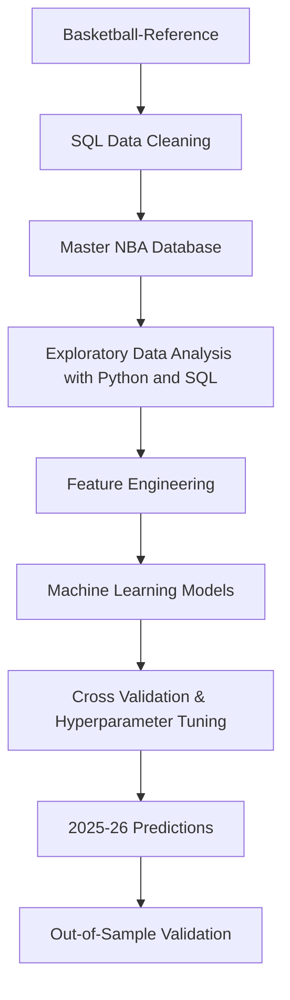

# NBA Breakout Prediction

## Project Overview

Can an NBA player's breakout season be predicted before it happens?

This project develops an end-to-end data analytics and machine learning pipeline to predict future NBA breakout players using historical player performance data. Five seasons of traditional and advanced NBA statistics were collected, cleaned, and integrated into a relational MySQL database before being analyzed in Python.Rather than relying solely on a player's current performance, this project focuses on year-over-year improvement by engineering delta features that measure changes in production, efficiency, and overall player value. These features were used to construct a custom Breakout Score, which identifies the top 20% of player improvements in each season and serves as the target variable for supervised machine learning.

Multiple classification models were trained and evaluated using historical player data. The final model was then validated against the completed 2025–26 NBA season by comparing preseason predictions with actual player outcomes, providing an out-of-sample assessment of the model's predictive performance.

## Problem Statement

NBA organizations, analysts, and fans often attempt to identify players who are poised for a breakout season before it occurs. While many evaluations focus on a player's current statistics, predicting future improvement is considerably more challenging because player development is influenced by multiple factors, including increased opportunity, efficiency, usage, and overall impact. The objective of this project was to develop a machine learning pipeline capable of identifying players with the greatest likelihood of experiencing a breakout season using only information available prior to that season. To accomplish this, historical NBA player statistics were transformed into predictive features representing year-over-year improvement rather than raw performance alone.

A custom Breakout Score was developed to quantify player improvement across multiple dimensions of performance. This score was then used to create a binary classification problem, allowing supervised machine learning models to predict whether an eligible player would break out during the following NBA season. The final objective was not only to generate preseason predictions, but also to evaluate how well those predictions generalized by comparing them with the completed 2025–26 NBA season.

## Dataset 

The dataset was constructed using publicly available NBA player statistics obtained from Basketball Reference. Both traditional and advanced player statistics were collected for six NBA seasons (2020–21 through 2025–26) and integrated into a MySQL relational database through a series of SQL data cleaning and transformation scripts.

To focus the analysis on realistic breakout candidates, only rotational players meeting the following eligibility criteria were included:

Criterion	Requirement
- Age	24 years or younger
- Games Played	≥ 20 games
- Minutes Played	≥ 12 minutes per game

The final dataset contained player-season observations with both traditional and advanced performance metrics, including:

- Points Per Game (PPG)
- Rebounds Per Game (RPG)
- Assists Per Game (APG)
- Player Efficiency Rating (PER)
- Usage Percentage (USG%)
- True Shooting Percentage (TS%)
- Box Plus/Minus (BPM)
- Win Shares (WS)
- Value Over Replacement Player (VORP)

The cleaned datasets from each season were merged into a single master database, providing the foundation for exploratory data analysis, feature engineering, predictive modeling, and final model validation.

## Methodology

The project followed a structured end-to-end analytics workflow beginning with data acquisition and ending with out-of-sample model validation. SQL was used to clean, integrate, analyze and organize historical NBA player statistics into a relational database, while Python was used also for exploratory data analysis, and later feature engineering, predictive modeling, and performance evaluation.

Rather than relying exclusively on raw player statistics, the project emphasized changes in player performance over time. Historical player data were transformed into year-over-year improvement metrics, allowing the models to learn patterns associated with future player development instead of simply identifying already established stars.

The overall workflow consisted of four major stages:

Exploratory Data Analysis – Examined player distributions, identified outliers, and evaluated relationships among traditional and advanced statistics.
Feature Engineering – Created year-over-year delta features, standardized improvement metrics, and developed a custom Breakout Score used to define breakout seasons.
Predictive Modeling – Trained and compared Logistic Regression and Random Forest classifiers using stratified train-test splits, cross-validation, and hyperparameter tuning.
Model Validation – Compared preseason predictions against the completed 2025–26 NBA season to evaluate the model's ability to generalize to unseen data.

## Project Workflow

